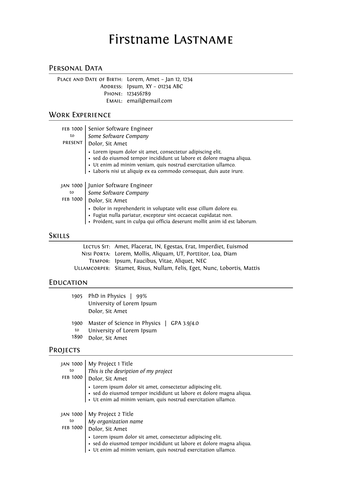

# Typst Resume/CV Template

A Typst Resume/CV template  
Inspired by Alessandro Plasmati's Graduate CV LaTex template

## Requires

The compilation of this project requires the following:

|              |                                        |
| ------------ | -------------------------------------- |
| Typst CLI    | https://github.com/typst/typst         |
| Fontin Fonts | https://www.exljbris.com/fontin.html   |
| Typst-Tablex | https://github.com/PgBiel/typst-tablex |

## Preview

See [cv1.pdf](https://github.com/vaibhavjhawar/typst-cv-template1/blob/main/cv1.pdf) for redendered PDF output



## Usage

1. Clone the repo

```
git clone https://github.com/vaibhavjhawar/typst-cv-template1.git
```

2. Edit the [cv1.typ](https://github.com/vaibhavjhawar/typst-cv-template1/blob/main/cv1.typ) file

3. Check dependencies and compile it with Typst

```
typst compile cv1.typ
```

It can also be compiled using as Typst project on [Typst app](https://typst.app/)

## License

[MIT](https://github.com/vaibhavjhawar/typst-cv-template1/blob/main/LICENSE)

